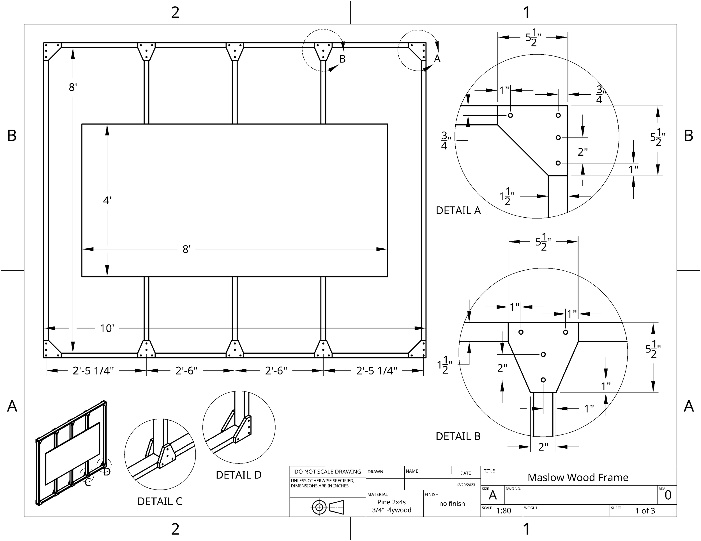
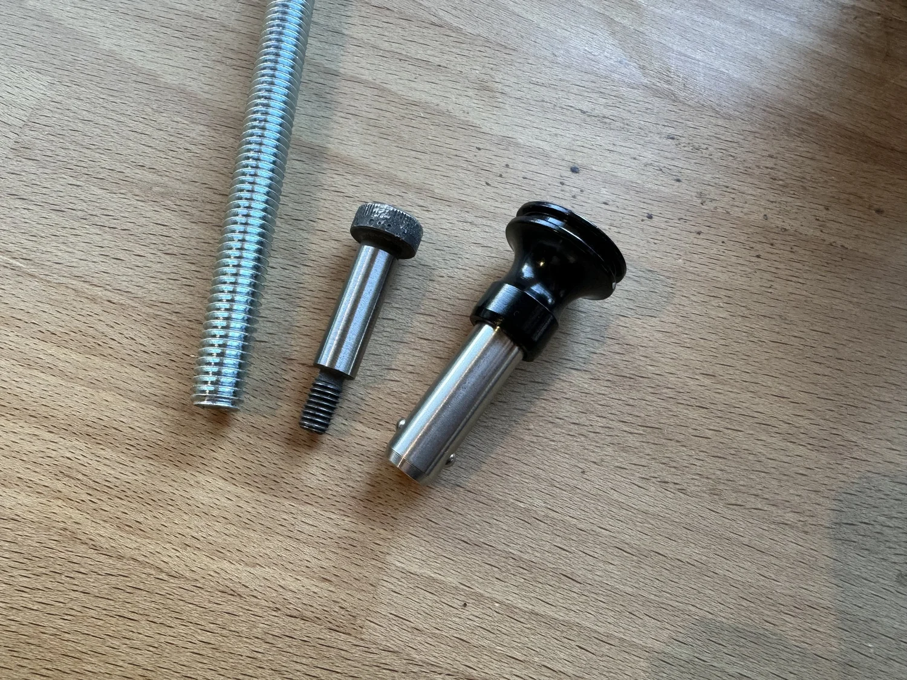
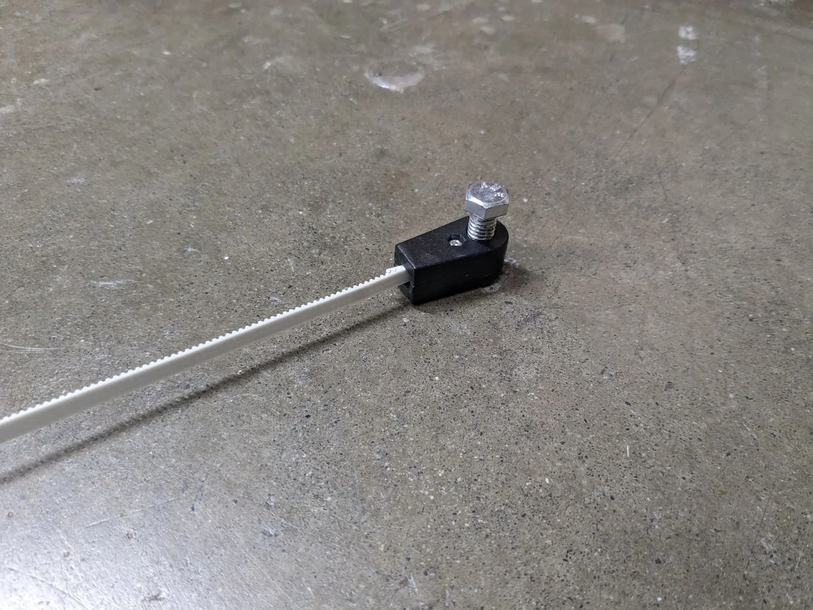
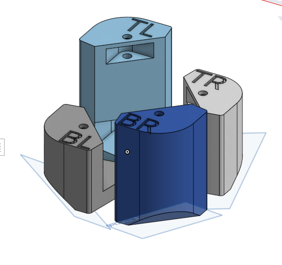
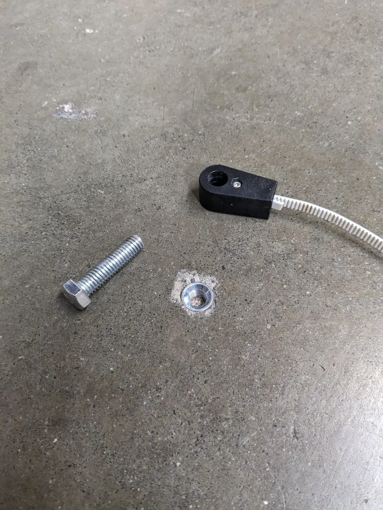
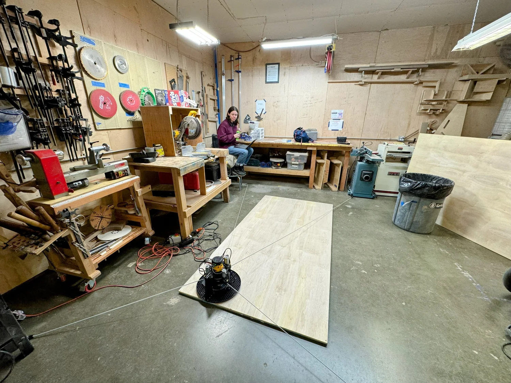
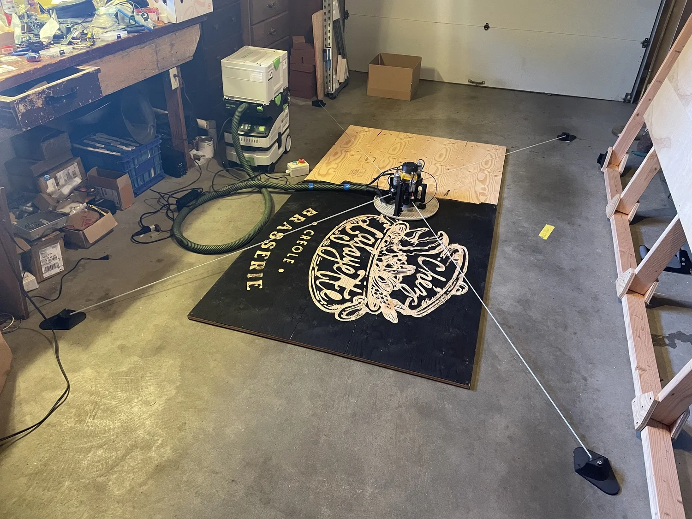
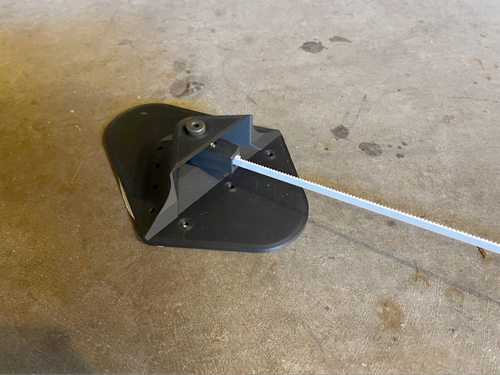

# Frame Library

# Intro

Maslow4 has to have four solid anchor points to pull on. They can be anchors drilled or glued into a floor, Pins attached to a tilted wall frame, hooks on the ends of spars, or even stakes driven into the ground.

This is a curated list of frame designs. If you have a good one make a branch and add your own at the end of the document then make a pull request to have it added. Add drawings, details and descriptions so that someone else could build your frame. Add links to cnc or .stl 3D printing files if the frame uses those as well as links to the forum if there is discussion of the frame there. 

## Frame calculators
As you plan 

Dlang has made a very useful and cool frame calculator here:
<http://lang.hm/maslow/maslow4_frame.html>

geertdoornbos has made a cool one where you can simulate the movement of the robot:
<https://maslowcnc.nl/frame>

Bar's frame simulator here: 
<https://maslowcnc.github.io/Layout-Simulator/>

Bar's Calibration point tester:
<https://barboursmith.github.io/Calibration-Simulation/>

These show areas where the Maslow can move accurately and areas where it will start to have trouble. These are determined partly by small angles and high tension near the edges (top edge especially in vertical mode) and partly by the arms carrying the motors of the Maslow bumping into the upright pilars of the maslow when the angle between them gets too small. Belts generally can't be closer than 130 degrees or farther apart than 140 degrees. 

## Frame requirements:
- The Four anchor points have to fit within a 5 meter by 5 meter square.  It is possible to go bigger with belt extensions which are sticks that attach to the ends of the belts. It is also important to make sure for your planned cutting area that the belts have enough length to go all the way across the planned moving space.
- Calibration starts by assuming a rectagular frame with all anchors in the same plane.  Your frame does not have to be a perfect rectangle but if you are having calibration issues this might be a place to adjust. 
- The anchors need to have free space in front of them. The belts and belt ends need to be able to swing freely back and forth without hitting things as the maslow moves around.
  
  

- Anchors can be a bolt, a shoulder bolt, cotter pin, or a quick release pin.Each of Maslow4’s belts terminate with a belt end ring which can be attached to an anchor point. The hole in the end of this part is 10mm or 3/8ths inches and can attach to a 10mm or 3/8ths inch bolt. It’s preferable if the bolt is smooth, but it will still work if the bolt is threaded.
- The anchor pins should be easy to pull in and out or slide the belt anchor off the top of them.

- The anchor pins should not allow the belt ends to slide up and down vertically or fall off of the top, you want just enough space on the pin for the belt end to freely rotate.
- It is better if the anchor pins are in the same plane with the top of the wasteboard that the material to be cut sits on. Even better than that would be if each was in a plane parallel to the sled base straight out from it's position on the Maslow robot. (if the belts came out perfectly straight from the robot)  Anchors will still work if they are below the wasteboard or up and down a bit individually but it will affect the accuracy of the robot's movements.
  
(image showing belt anchors lined up with belt heights. credit dlang) 
- The anchors need to be solid and not move in any direction. They will be pulled on by the machine with many newtons or as much as 40 pounds of force.  The anchors should not flex the frame that they are attached to.  The more solid the better.
- The frame should include a wasteboard that can be replaced and cut into underneath the intended cutting area.
- The cutting surface should be fairly stiff and flat. Maslow's sled can ride up and down a flexing or curved board but it will affect the accuracy. It is important that the surface that Maslow4 is connected to not flex under that force. This is more important in the vertical configuration where the stresses due to pulling the belts tight are quite different at the top of the sheet than at the bottom of the sheet. In the horizontal configuration the forces are more similar everywhere.
- The frame should fully support the material to be cut.  How will the material be anchored to the frame? You never want the router bit to hit anything steel.  Brass screws, Alluminum screws, plastic pins, bamboo pins, wooden clamps, double sided tape, carpet friction pad, vacuum tables, steel screws well away from the cutting area all work.
- Frames can lie horizontal all the way up to 20 degrees from vertical. Maslow needs a little weight to pull it against the project
- Frames may need to have room for extra wood around the outside of the cutting area at the level of the cutting surface. For cuts that go right to the edge Maslow will tip over when the sled is not supported.
- You can very carefully measure the distance of your frame pins from each other, and assuming you have made it a nice rectange, enter those positions into the Maslow software directly instead of calibrating. For example you would measure in mm from the left side of one anchor pin to the left side of another. This is entered in the Maslow control program under ?settings?. 
- Belt extensions are freely rotating sticks or machine belt that you could optionally add to the ends of the built in maslow belts in order to make a larger frame with a wider cutting area.  So far people have made belt extensions by adding a metal bar at an anchor where it can freely rotate and then attaching the existing belt to the end of the bar. You would enter this in the Maslow control program under ?settings? directly

## Safety

When attaching Maslow4 to a surface it’s important to ask “How bad would it be if I were to cut through the thing that I am cutting and hit this surface. If the answer is “Very bad” then it’s not a great surface to cut on. Generally there is a spoil board or waste board under the piece of wood being cut which protects the underlying surface, but mistakes can happen.

Consider ventilation, flying debris, people's access to the space, noise, and fire risks in the space where you install your frame. 

  

# FRAME LIBRARY 
## To add a frame start a new entry with a title started by three ### hash symbols then add pictures, materials and description and links.  Still working on what is a useful format here, use your judgment. If we use the heading system built into markdown it will automatically create a table of contents in the top right corner of the reading pane. 

### Example frame entry heading text
PICTURE
- Overview:
- Links:
- Materials:
- Details:
- Notes:
- More Pictures:
- Credits:

## Floor Anchor Systems

### Floor Bolts from Maslow instructions

- Overview: Drill holes in a concrete floor, insert threaded anchor sleeves put wasteboard on ground in the middle perhaps on a rubber rug fabric anti slide sheet.
- Links:
-- https://www.maslowcnc.com/attaching-to-the-floor
-- https://www.grainger.com/product/DEWALT-Expansion-Anchor-3-8-16-Thread-30RZ53
- Materials:
- - 4  3/8"-16 exapansion bolts.
  - 4  3/8"-16 1.5 or 2 inches long Hex Cap Screw bolts
  - 8  3/8" fender washers optional
  - 4x8' nonslip rug netting fabric
  - 4x8' wasteboard, could be rigid foam insulation, OSB (oriented strand board, plywood or particle board. 
- Details: Drill holes, insert threaded anchor sleeves, perhaps epoxy them. screw bolts in and out each time to attach the belt ends. 
- Notes:

### 3D printed Anchors glued or bolted to a concrete or wooden floor
### Includes a list of different 3D printable Designs. 

- Overview:
- Links:
- Materials:
- Details:
- Notes:
- More Pictures:
- Credits:  

## Vertical format frames

## Horizontal format frames

## Other frame Formats

