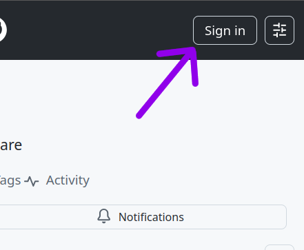
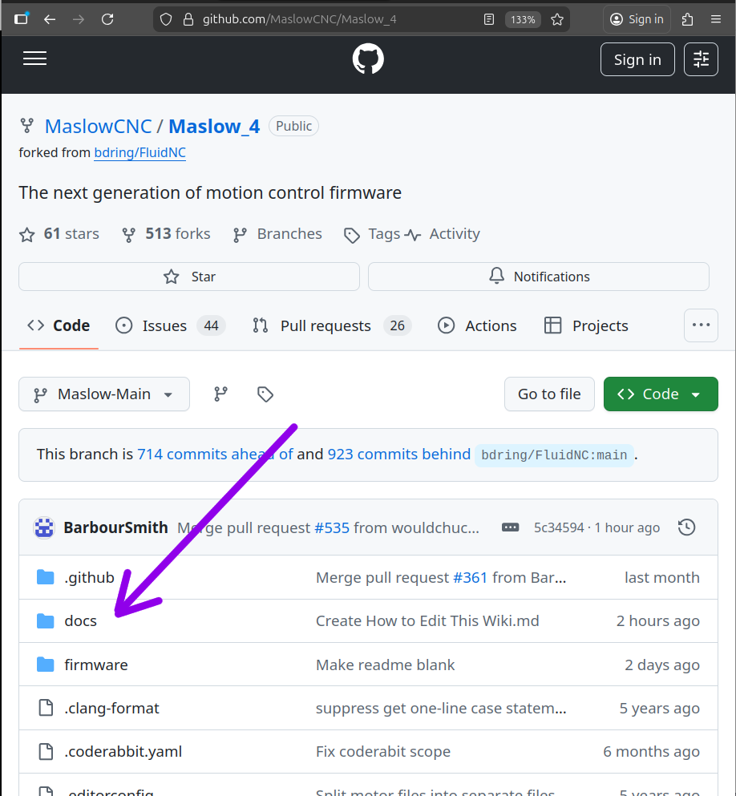
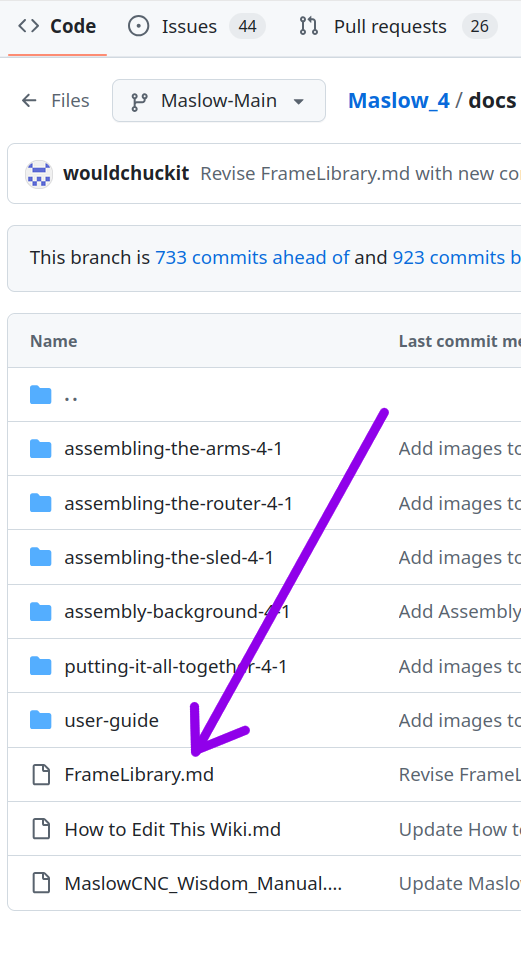
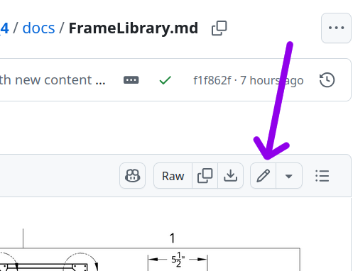
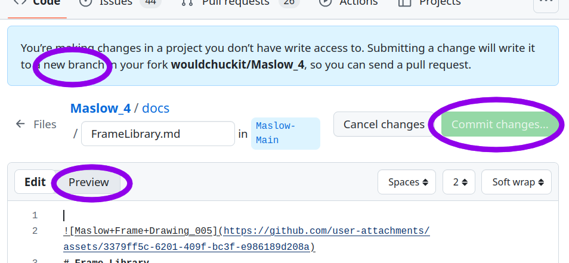
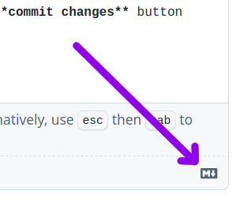
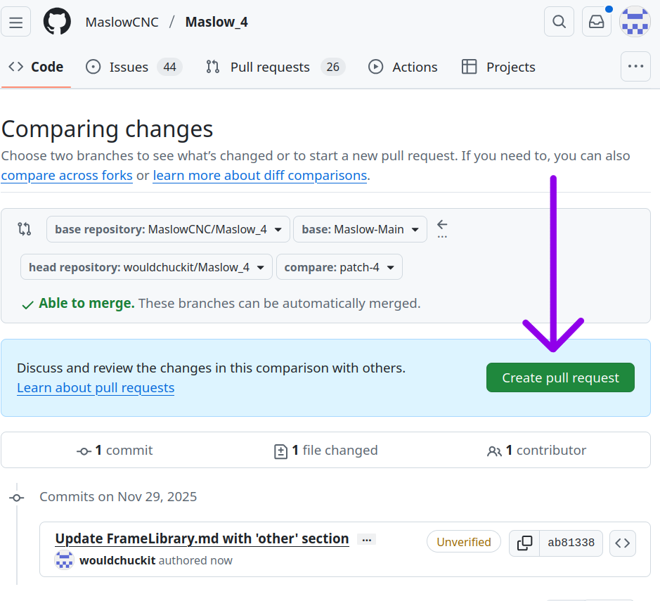

# WELCOME!
Maslow is a truly open source project.  Anyone can propose an edit to make it better. Anyone can branch it to make a new project. (see repo license statement) 

This is the Maslow 4 wiki. Maslow has an active and helpful Forum pertaining to all versions of the Maslow project.  This space is where we are trying to collect and organize all the information to make Maslow Version 4 work. It includes the firmware programming, the parts lists and part designs, instruction and user manuals, and libraries of projects, frames, alternate parts, useful software, router bits, router settings and other useful things.  As you discover or develop your own system, please share what worked for you here. This is a community of people sharing knowledge. 

Github can be intimidating if you have not used it.  The great thing about editing here is you can't mess anything up.  Anybody can propose and mess with changes which are stored as a copy or branch of the repository until you request that they are merged into the main repository. There is an automatic checking system as well as human checks before your changes are written back to the main branch. 

If you know programming, then you are probably familar with Github repositories and can propose changes to the programming. There is a Maslow Github Ai which helps write code in response to user prompts.  Try it. 

If you don't know programming you can still share your projects and designs and advice through these user documents. 

## Instructions for getting started using a web browser: 

1. Make a Github account by clicking on the **Sign in** button on the top right corner of the webpage.

Click on the **Create an account** link near the bottom of the page. Follow the instructions there.

2. Make sure you are in
 <https://github.com/MaslowCNC/Maslow_4>

3. To add an entry to the frame library click on the folder labeled **docs**
4. Scroll down to the **FrameLibrary** document and click on it's name.

 
 
5. In the top right corner of the reading panel there is a **little pencil**. Click on it to start editing.

6. When you start editing Github will make a new branch of the project for you. You can change things and it won't affect the main branch. If you have made a good new frame or adaptation, add it. 

7. In this view you are using a simple word processing text editor called **Markdown**. When you are editing it looks a little different than it will when it is displayed.  In order to see what it will look like click on the **preview** button.
   
8. Markdown uses some editing symbols to make headings and lists and other things. there is a guide always available at a **tiny M symbol** at the bottom right corner of the screen.

It will bring you to this guide:

<https://docs.github.com/en/get-started/writing-on-github/getting-started-with-writing-and-formatting-on-github/basic-writing-and-formatting-syntax>

 
9. When you have edited the document click on the **commit changes** button
10. Your work is saved and stable.  You can keep working in your branch to change more things.  When you have finished you will need to make a **pull request** to request that your work be merged back into the main branch. To make a pull request click on the green button. If you lose your pull request go back to the main branch and click on Pull requests at the top to find it again. 
13. When the owner of the main branch repository sees your request they can approve it or merge just parts of it.  

# Be brave and add your knowledge and wisdom to the project. 

   

