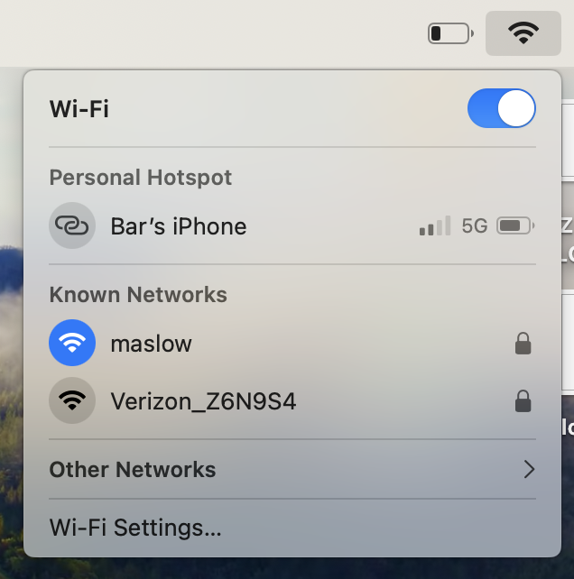
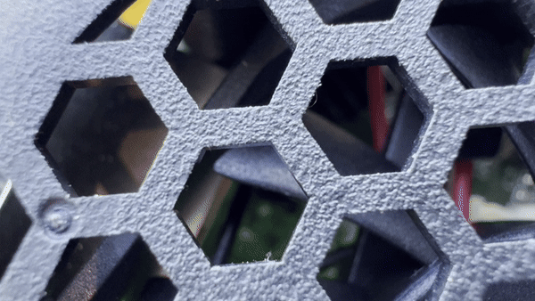
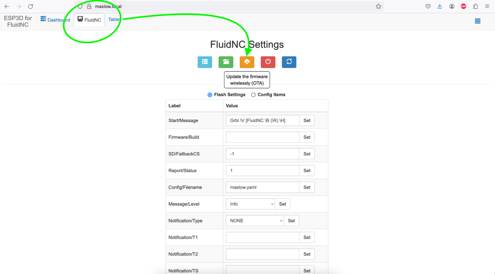
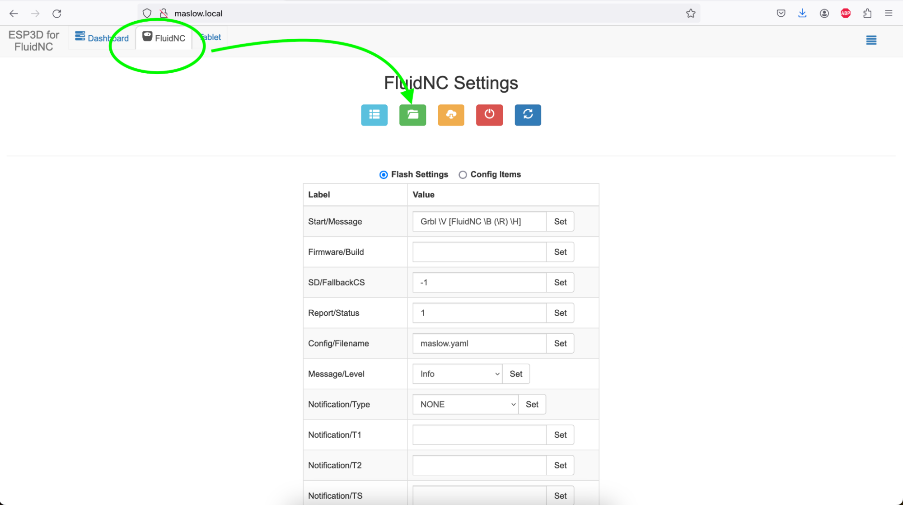
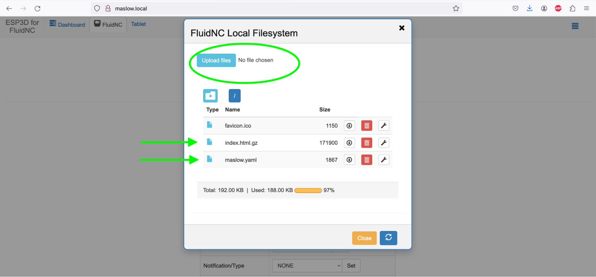
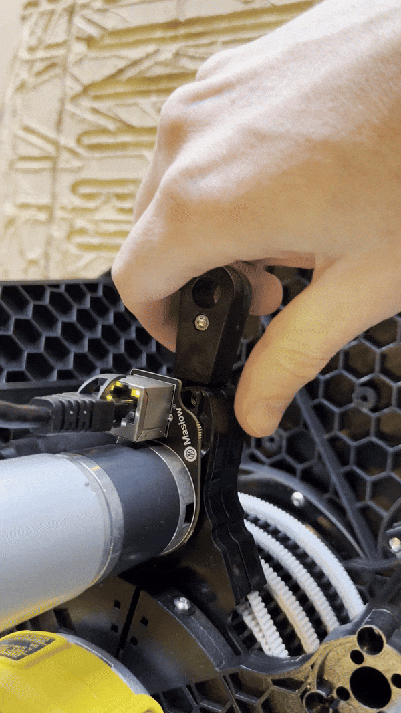
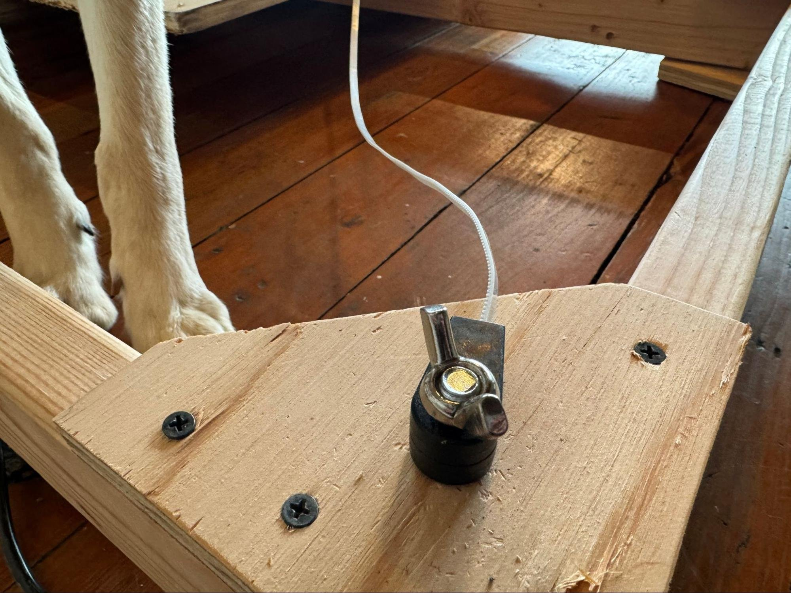
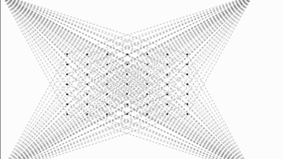

# Quick Start Guide

This guide is intended to get your Maslow up and running in as few words as possible. It is intended to be used immediately after completing assembly so we can assume that the user has already assembled their machine and they are now looking for how to set it up.

  
## Choosing your Anchors

Maslow 4 is designed to turn any flat rigid surface into a large format CNC router. This is powerful, but it can lead to an overwhelming number of options. 

The best option is to attach the machine directly to a concrete floor. This can be done by either attaching 3D printed anchors to the floor or by adding threaded inserts into the concrete.

The anchors are sized to fit a 10mm or 4/8ths inch bolt.
 

 
You can find a complete list of different anchor types here: [ADD LINK]

  If you don't have a floor to connect to you can construct a flat rigid surface to use the machine on. You can find instructions to assemble a basic one that we recommend here: https://www.maslowcnc.com/frame-options

We've put together a tool to help you to better understand what size of frame you might want and how that will impact your cutting area. You can find that tool here: https://maslowcnc.github.io/Layout-Simulator/

- Size and other considerations
  - Belt ends need to be loose to rotate in the XY directions but gently held in the z direction so they don't pop up and down.
  - Belt ends will be taken on and off a lot. 
  - Can be horizontal to 20 degrees from vertical.
  - Does not have to be exactly rectangular.
  - Software limits basic frames to less than 5 meters wide and tall.
  - Belts are 4.4 meters long. Cutting area can not be farther than that from an anchor. 

## Connecting
	
  Maslow4 is controlled using a built-in interface accessible from your web browser. You can connect to Maslow4 from any Windows, Mac, or Linux computer or iOS or Android tablet or phone. You do not need to install any software. 

Maslow4 will create a wifi network called **“maslow”** which you can connect to. The default password for this network will be **“12345678”**.

Connecting to the network will automatically open the user interface on most devices. If it does not you can type **192.168.0.1** into your web browser to open the interface. 

- Connecting Maslow to your wifi

  While you don't need to connect Maslow to your home wifi network for it to work, if you have wifi available the next thing to do is to connect to it.

  To connect Maslow to your wifi press on "Setup" in the top right corner.

  Then press "Config"

  Then enter your wifi network information and press save.

  Maslow will try to connect to this wifi network every time it powers up. If it can't find that network or cant connect for some reason it will create the Maslow wifi network for you to connect to it. Turn your Maslow off and back on to let it connect to your wifi network.

  Once Maslow is connected to your wifi network you you can access it by navigating to the address **maslow.local** from any browser. If you are having trouble finding it try a different device or browser.

  As a last resort you can always find your machine's IP address by counting the blinks of the blue light.

  

## Updating the firmware

Maslow4’s firmware is improving regularly.

Luckily updating the Maslow4 firmware is easy. 

To update Maslow4’s firmware click on the FluidNC tab at the top of the screen, then click on the Update the Firmware button, and select your new firmware file.

You can always find the latest firmware version at [https://github.com/BarbourSmith/FluidNC/releases](https://github.com/BarbourSmith/FluidNC/releases)

There will be 3 files that you need to download, **firmware.bin**, **index.html.gz**, and **maslow.yaml**. When you download the files, make sure your computer does not change their name. You must change the name back if this happens.

Note: When you first connect to Maslow it will create a popup to control the machine. On some devices you cannot upload files from within that popup (the window won’t open). The solution is to connect to Maslow from a regular browser window.

Note that to update from a firmware version before 1.0 to a version after 1.0 you will need to use a USB cable. There is a video walkthrough for that process [here](https://youtu.be/od7DpdLel6A?si=xv1Zp3AIZFgRoeZ_).

There are two other files which you will need to update periodically. These can be found by clicking on the FluidNC tab and then clicking on the files button.

This will show you your system files.

To upload a new file click the Upload files button at the top of the screen. If a file with the same name already exists it will be replaced.

index.html.gz controls how the machine interface looks. If you wanted for example a dark mode, replacing this file would give the interface a new look. I expect that there will be a number of community created UI options created quite quickly.

maslow.yaml contains the configuration settings for your machine. Your calibration values are stored here. You may not need to update the yaml each time you update the index and the firmware.

## Extending and Retracting the Belts

The Maslow 4 belts can be retracted for storage and extended for use. 

Every time that the belts are retracted the machine will use that as an oportunity to reset it's understanding of how long each belt is. This is done by monitoring the current required to retract each belt. If your machine is in an unknown state retracting the belts will help it to understand exactly where it is.

To retract the belts press **Setup -> Retract All**

If all of your belts don't fully retract you may need to increase the amount of force that the machine uses to retract. You can do this by clicking on **Config** and increasing the retraction force. The lower that this number can be the better.

When you are ready to extend your belts, press **Extend All**. Extending the belts can take a little practice. To prevent tangles the belts will only extend as long as you are pulling on them. Use a rocking motion to start the belts extending and then pull steadily.

The belts will extend to the length set in the config file. If you need to extend more belt to reach your anchor points, adjust the number there and press **Extend All** again.

Once all four belts are fully extended you will hear the cooling fan turn off. Connect each of the four belts to your four anchor points.

## Finding your anchor point locations

If you haven't prevously connected your machine to these anchor points, you will need to locate them. This can be done with a tape measure, but that is slow and error prone. 

Press **Find Anchor Locations** to have the machine take a series of measruements to automatically locate the anchor points for you. The machine will move through a grid of points and take measurements at each one. 

Be sure to leave your web bowser tab open through the entire process because the calculations will be done there since your computer has much more processing power than the ESP32 in the Maslow. 

Keep an eye on the machine during this entire process, it may be tempting to walk away, but it is important to keep an eye on it.

## Generating gcode 

## Uploading to Maslow

## Move the machine around

## Define home position

## Running a file
