# Assembling the Router 4.1

This guide will walk you through assembling the router mount for your Maslow 4.1 CNC. The router assembly connects your router to the sled and provides Z-axis movement.

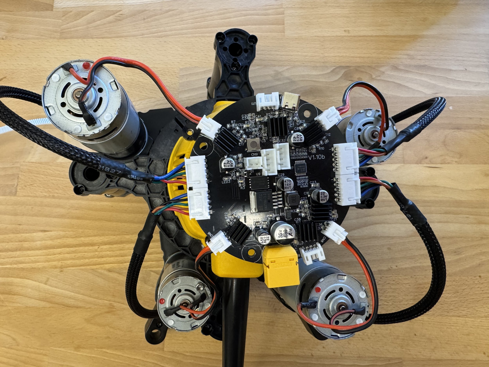

## Tools and Parts Needed

- T10 Torx screwdriver
- Allen wrench
- DeWalt DWP611 router (or compatible)
- PCB mounting plate
- Router clamp and wedge
- Lock nuts
- Eight upright pieces
- Linear bearings
- Bolts

## Step 1: Prepare the Router

Remove the router body from its stock base. The base is not needed for the Maslow 4.1 installation.

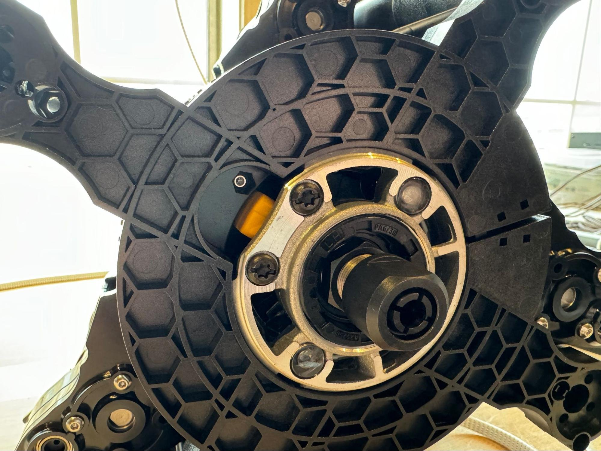

## Step 2: Attach PCB Mounting Plate

Attach the PCB mounting plate to the top of the router. Make sure this piece is oriented correctly (often with power cords pointed down). A firm tap may be needed to seat it properly.

## Step 3: Assemble the Router Clamp

Find the first clamp and wedge. Separate them and insert the lock nuts into their designated slots. Reassemble the wedge and lightly start threading the bolts.

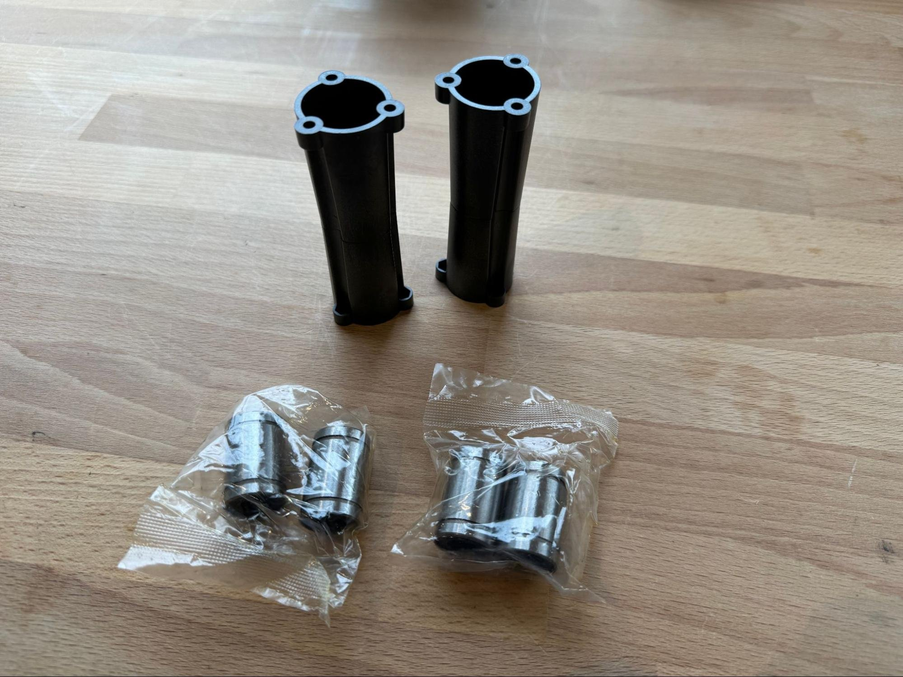

## Step 4: Attach Clamp to Router

Slide the clamp down onto the router with the notch toward the power cord. Tighten the bolts to secure it in place.

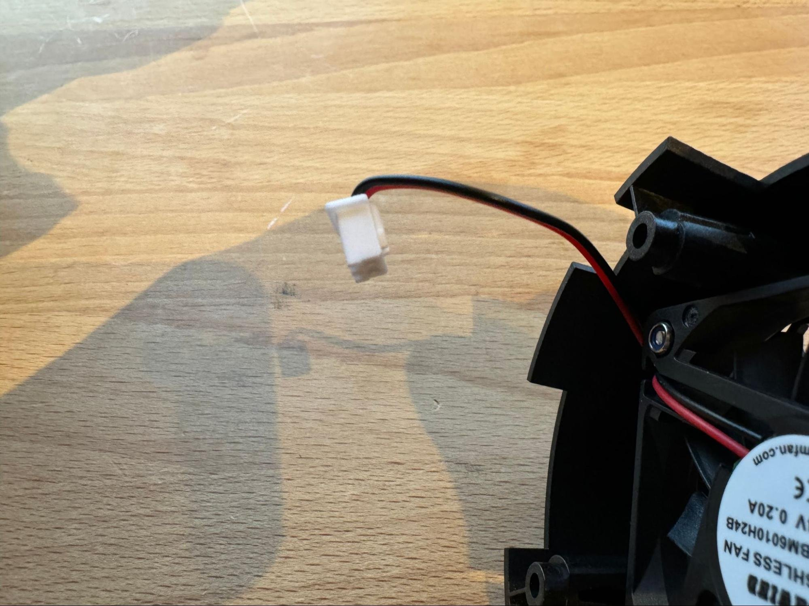

## Step 5: Build Uprights

Stack pairs of upright pieces. Place nuts using an Allen wrench, and thread bolts from below so gravity holds the nuts in place. Repeat for all four sets (eight upright pieces total).

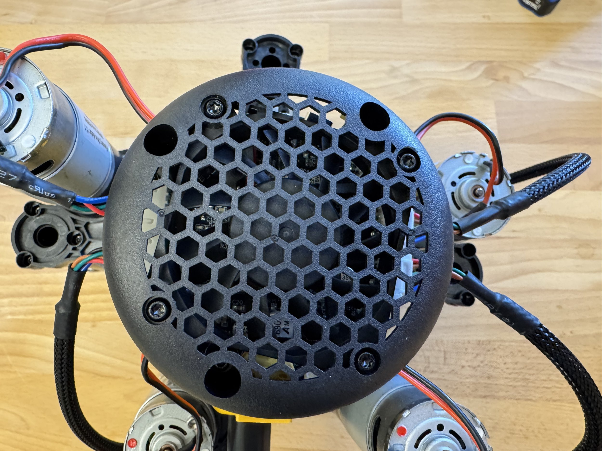

## Step 6: Install Linear Bearings

Insert linear bearings into each end of two uprights. These will be the uprights that go to the left and right of the power cord when assembling.

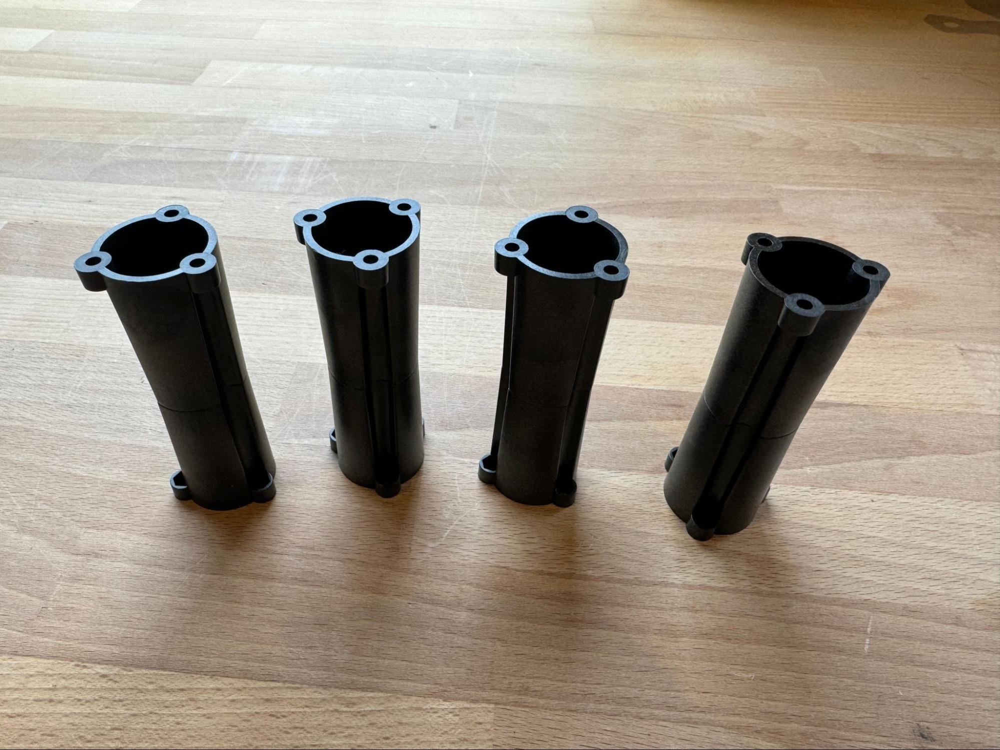

## Step 7: Attach Uprights to Clamp

The two bearing-equipped uprights go on the sides near the power cord. The other two uprights without bearings go in the remaining positions. Secure with bolts.

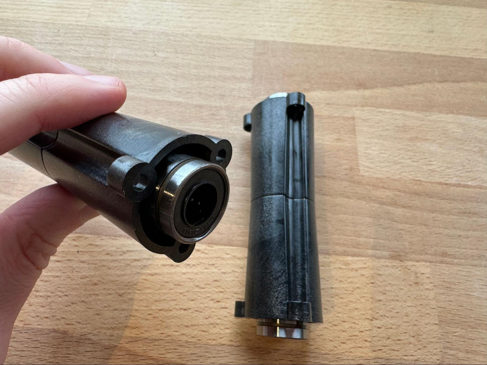

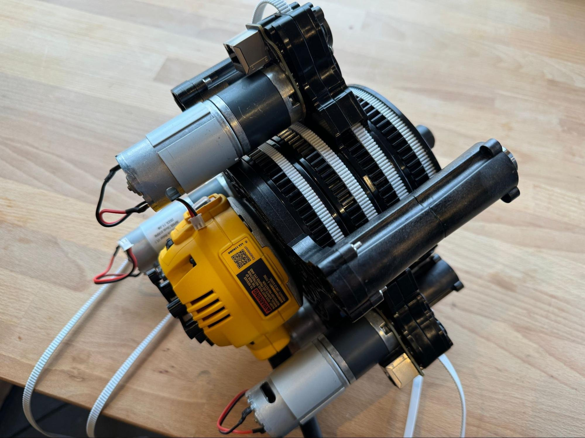

## Step 8: Install Arms

Slide the four arm assemblies onto the router in the order specified in the assembly diagrams. Reference the official instructions for the correct sequence.

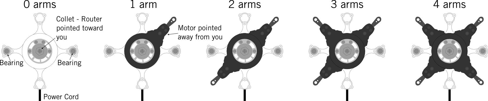

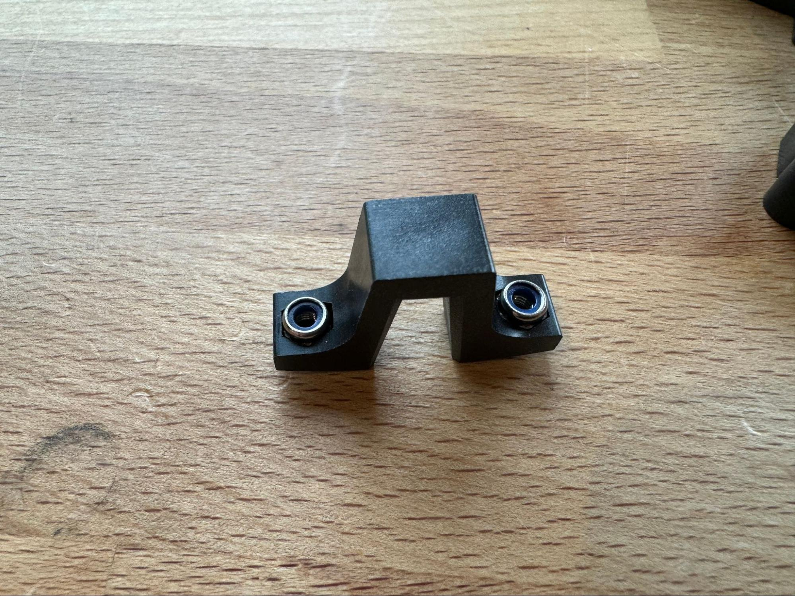

## Step 9: Secure Leadscrew Nuts

Remove the leadscrew nuts from the Z-axis motors. Bolt them to the second router clamp.

## Step 10: Final Assembly

Place the router assembly onto the sled, aligning the power cord with the dust collection port outlet. Attach linear rod supports and secure everything.

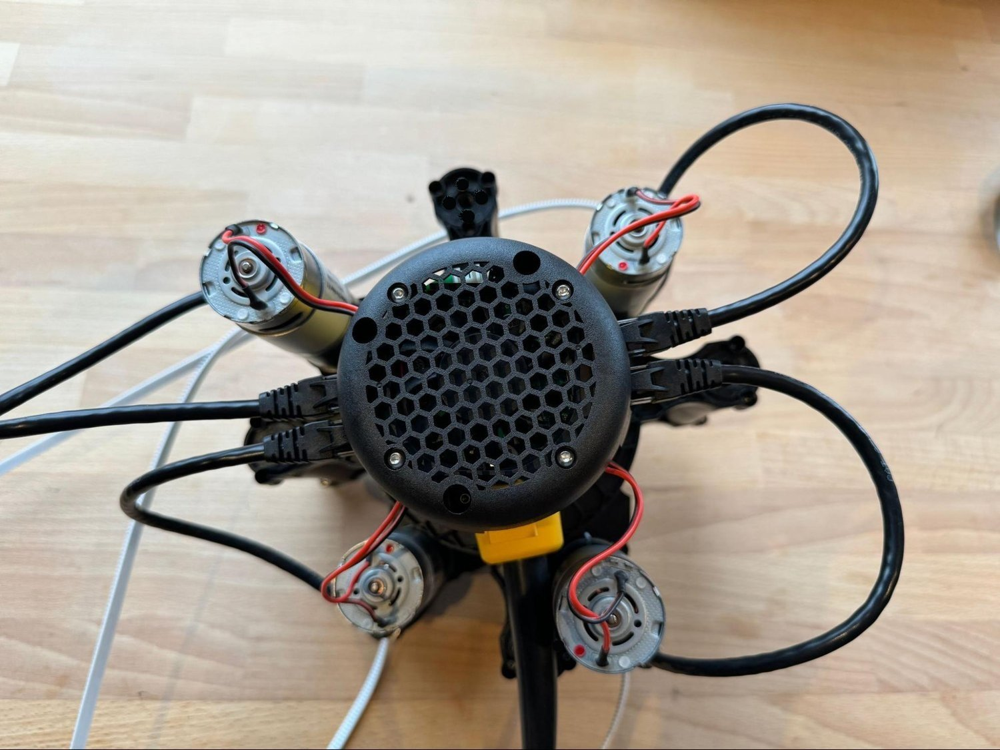

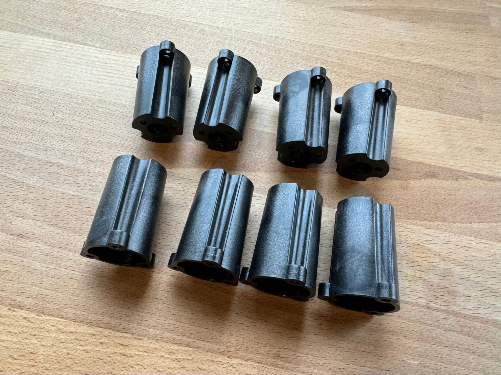

## Router Compatibility

The Maslow 4.1 is designed for the DeWalt DWP611 (diameter: 69mm). Other compatible routers may work, but only the DeWalt is guaranteed to fit out of the box. If using a different router or upgrading to a brushless spindle, ensure the diameter is ≤69mm, otherwise you may need to print a spacer adapter.

## Tips and Troubleshooting

- Use Allen keys or precision screwdrivers for tight spots.
- Tighten bolts just snugly—do not overtighten, especially on plastic parts. Many users use the "three-finger torque" method to avoid stripping threads.
- Expect some small gaps; 1-4mm play is normal between arms.
- Assembly can be done in a weekend with basic hand tools.

## Next Steps

Once the router is assembled and mounted, proceed to [Putting It All Together](../putting-it-all-together-4-1/README.md).

## Resources

- [Maslow 4.1 Assembly Video](https://www.youtube.com/watch?v=qDF2Xozx1bA)
- [Maslow CNC Forums](https://forums.maslowcnc.com/)
