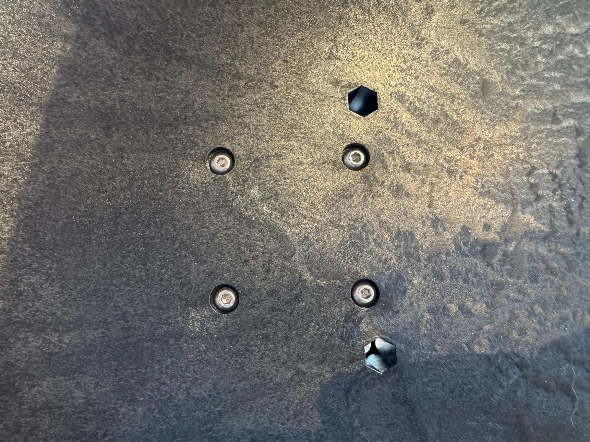
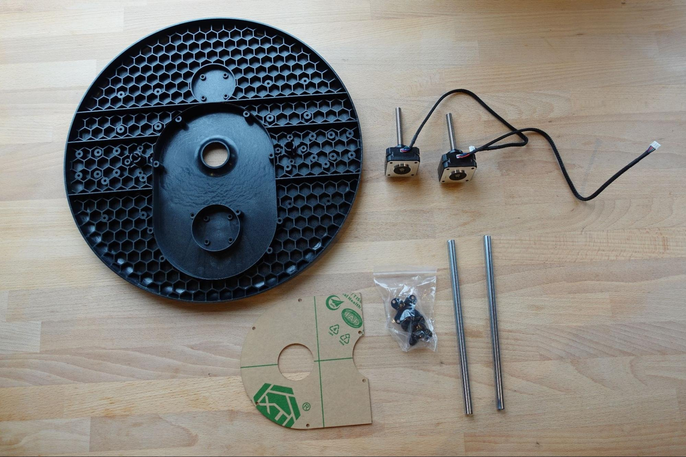
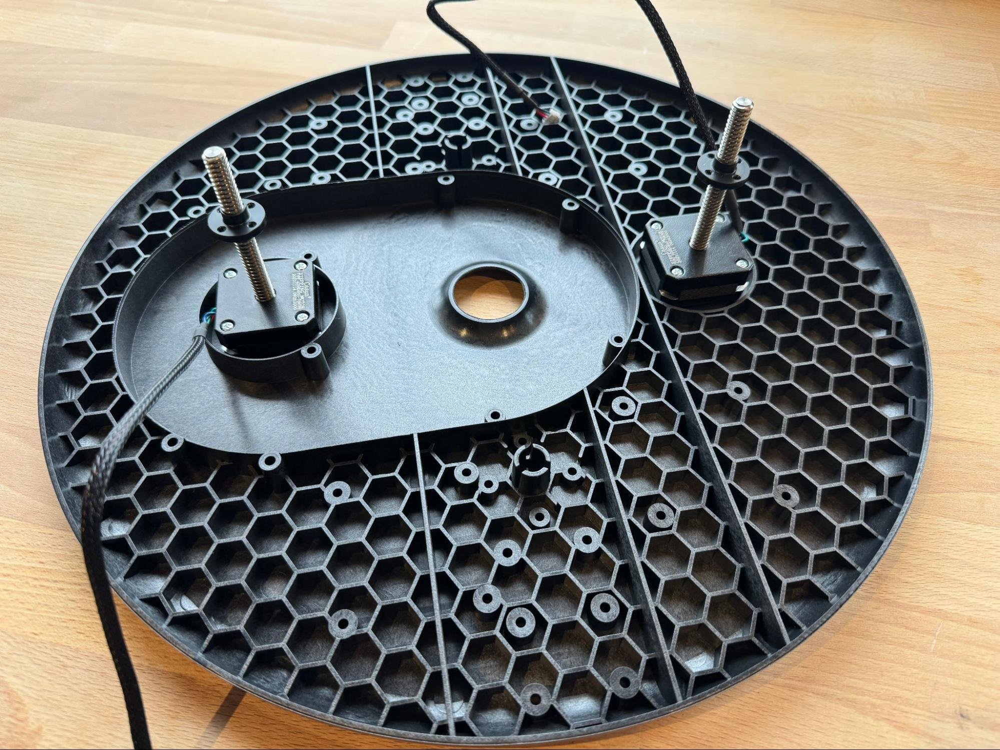
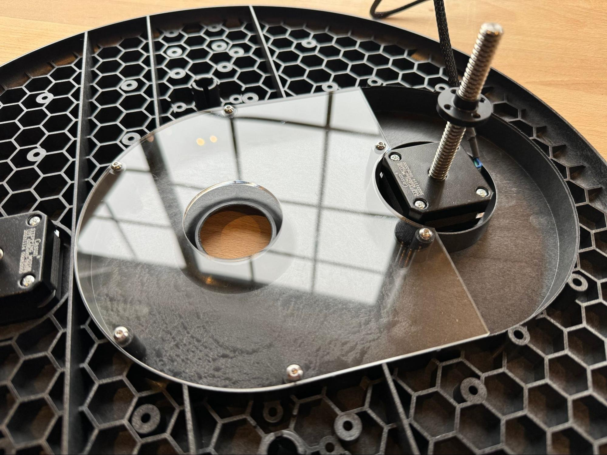
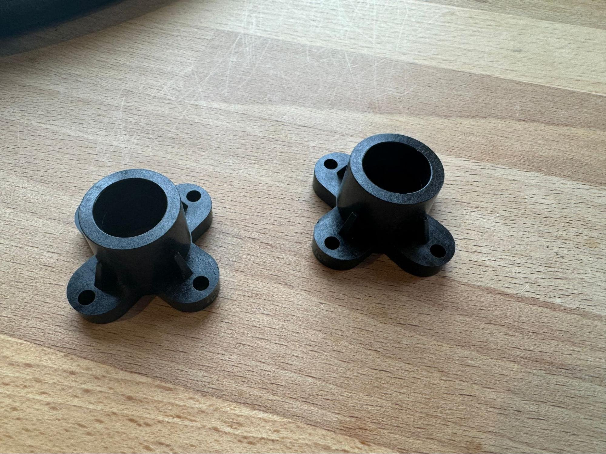

# Assembling the Sled 4.1

This guide will walk you through assembling the sled for your Maslow 4.1 CNC. The sled is the platform that holds your router and moves across the work surface.

## Tools and Parts Needed

- T10 Torx screwdriver (included in kit)
- Hammer (optional, for seating linear rods)
- Sled base
- Two stepper motors
- Two linear rods
- Two linear rod clamps
- Dust cover
- Eight short bolts (for stepper motors)
- Six regular bolts (for dust cover)
- Eight bolts (for linear rod clamps)
- Assorted nuts

## Step 1: Attach the Stepper Motors

Use the eight small bolts to attach the stepper motors to the sled. Insert the bolts through the holes in the sled and screw them into the threaded holes in each stepper motor.

> **Tip:** Orient each motor so that the cord faces toward the outer edge of the sled for easy cable routing.

## Step 2: Attach the Dust Cover

Flip the sled upside down. Drop the nuts down from the top and insert the bolts from the bottom to secure the dust cover. Use six regular bolts and nuts for this step.

Make sure the dust cover fits snugly over the stepper motors and wiring.

## Step 3: Install Linear Rods

If the linear rod clamps are pre-installed due to shipping, remove them first. Insert the linear rods into their openings on either side of the sled.

> **Tip:** A gentle tap with a hammer can help seat them fully, but don't use excessive force.

## Step 4: Secure Linear Rods with Clamps

Place the linear rod clamps around each rod. Attach each clamp with four bolts, for a total of eight bolts.

> **Important:** Tighten bolts evenly, moving around in a circle. Only snug them—do not overtighten, as it can crack the sled or clamp extrusions.

## Step 5: Final Checks

- Double-check the orientation of stepper motors and linear rods.
- Ensure all bolts are secure but not overtightened.
- Verify that the cords are properly routed away from moving parts.

## Tips and Troubleshooting

- Maslow 4.1 uses Torx drive bolts (T10 for most, T8 for gear set screws) to reduce strip risks. Allen-style Torx tools are usually supplied in the kit.
- If upgrading from Maslow 4.0, the 4.1 kit includes new rods cut to precise lengths. Use them if your original rods were off, otherwise reuse the existing ones.
- Be gentle with bolt-tightening, especially on clamps and mounting posts—these can crack, especially in tough environments or if overtightened.
- Some users have opted to 3D print replacement clamp posts for better durability.

## Next Steps

Once the sled is assembled, proceed to [Assembling the Router](../assembling-the-router-4-1/README.md).

## Resources

- [Maslow Sled Assembly Video](https://www.youtube.com/watch?v=WMvcFm7Cb1M)
- [Maslow CNC Forums](https://forums.maslowcnc.com/)
