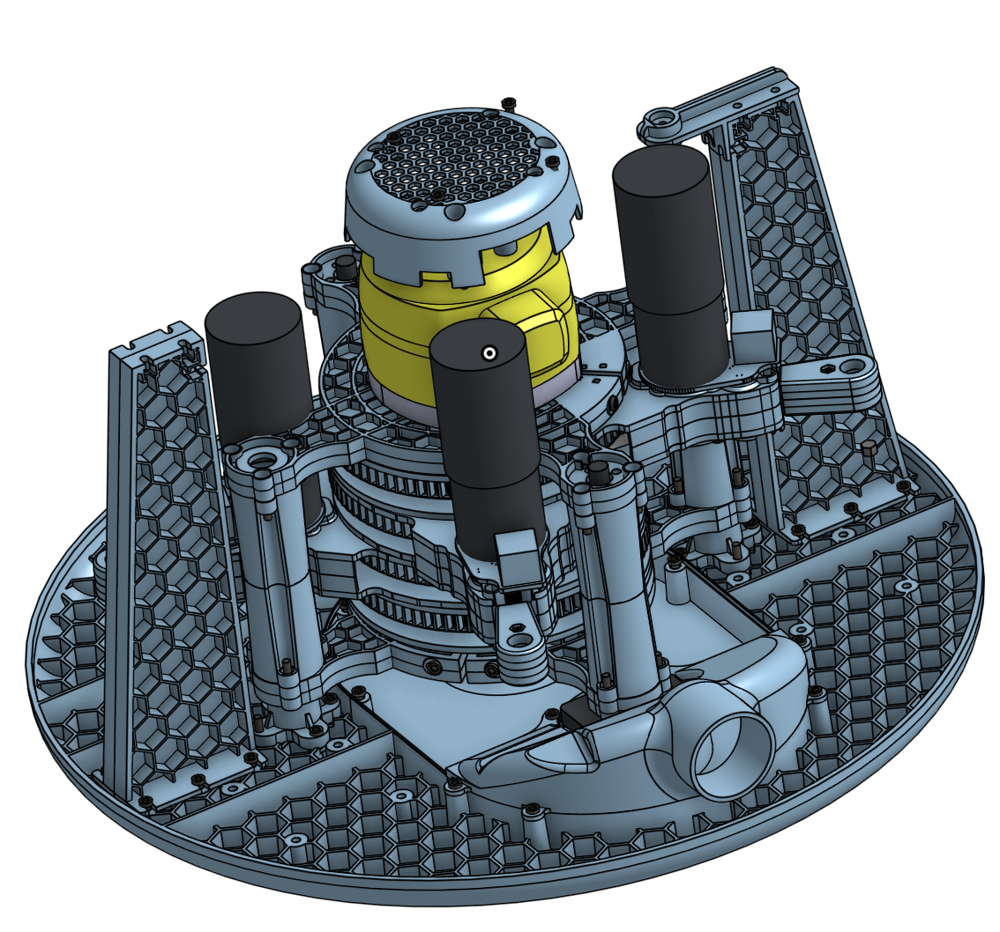
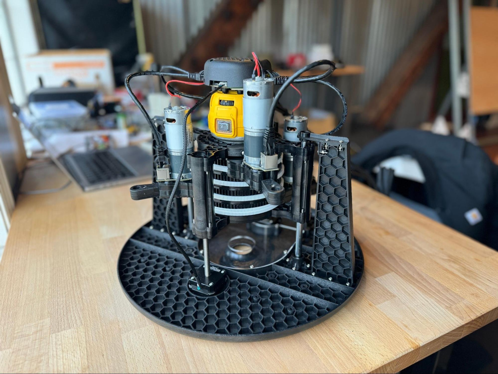
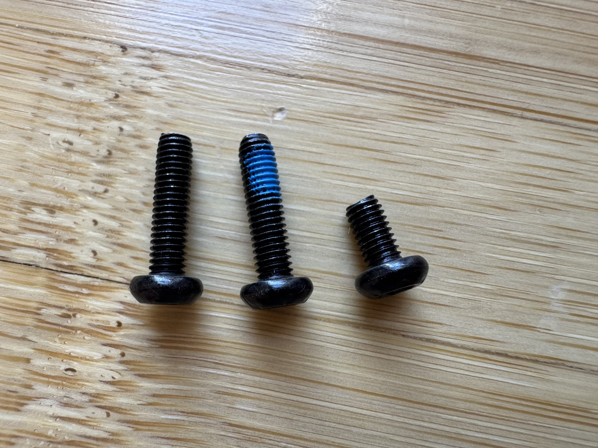
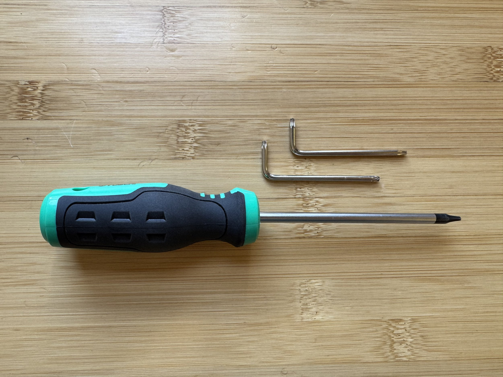
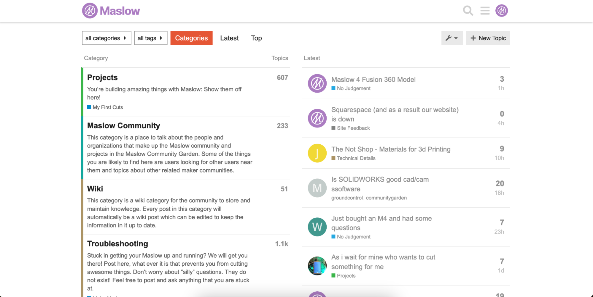

# Assembly Background 4.1

The Maslow4 design has evolved significantly since we launched the Kickstarter. We are proud of every change and improvement that we've made. Maslow4 is a substantially better machine than what we initially promised as a result…but we're still improving. If you have ideas for how to improve Maslow even more, share them in the forums. Most of our best improvements have come straight from community feedback.

## Standardized Hardware

Wherever possible Maslow4 is designed to be put together with a single length of bolt (the versatile M3x12mm) to make assembly and maintenance easy. For the most part we have succeeded in that, however there are two places where a slightly different bolt is needed. The shorter M3x6 are used to attach the stepper motors due to space constraints, while the bolts with blue thread locker are used to attach the DC motors.

## Torx Drive Bolts

Maslow 4.1 replaces the old allen bolts with torx drive bolts to reduce the chances of stripping out the bolt heads. We have included both an allen key type torx wrench and also a torx driver in your kit. Wherever possible we've tried to make it so that things can only go together in one clear way.

## Your Feedback Matters

If at any point we've failed to make a step in the instructions sufficiently clear let us know in the forums! If something was unclear to you it's almost certainly unclear to other folks too. Your feedback helps to improve the assembly process for everyone. We would be especially interested to hear how difficult you found the process and how long it took. What age of kids do you think that Maslow4 would be an appropriate project for with parent supervision?

Finally, if you get stuck on something or have a question, the forums are also the best place to get a quick answer. The sum total of the Maslow community is astounding.

## Let's Get Building!

This is a project that we are passionate about seeing out in the world, and we can't wait to share it with you. Let's get building!
